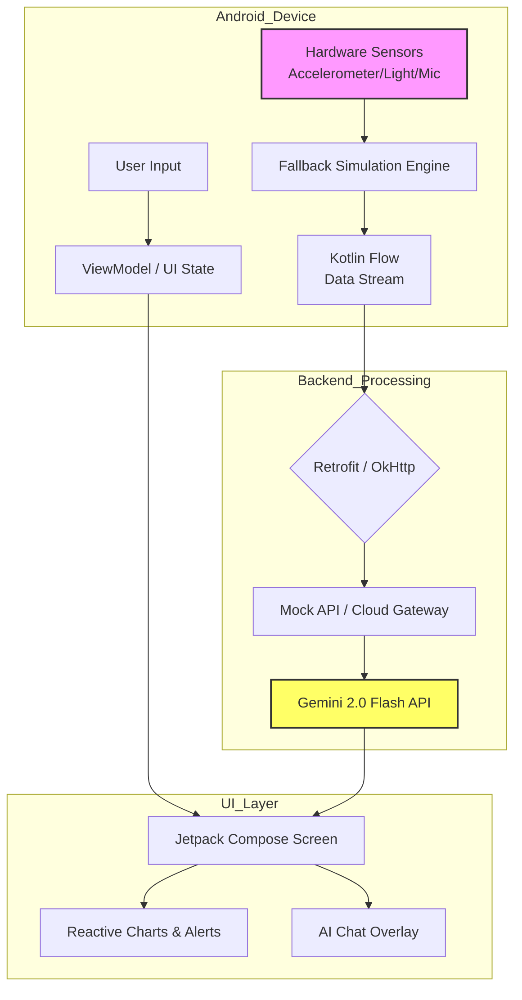

---

### Matchday AI (Enterprise Stadium Operations)

# ⚽ Matchday AI
### The Android Command Center for Next-Gen Stadium Operations.

> **From fragmented chaos to a unified cockpit.**  
> *Integrates crowd analytics, environmental telemetry, and an AI co-pilot onto a single tablet for ops teams.*

## 🌟 The Problem
Stadium operations rely on siloed systems: Security has one screen, Sustainability has another, and Fan Services uses a walkie-talkie. **Matchday AI** breaks these silos, providing a real-time, reactive dashboard that turns raw sensor data into actionable operational intelligence.

## ⚡ Core Features
- **📊 Unified Real-time Dashboards**: Live incident management, occupancy heatmaps, and sustainability metrics (energy/air quality) in a single view.
- **📡 Hardware-Aware Telemetry**: Uses Android Sensor APIs (Accelerometer, Ambient Light, Microphone) with an **intelligent fallback simulation**—meaning the app works flawlessly even in demo environments without physical hardware.
- **🤖 Gemini-Powered Fan Co-pilot**: Fans can ask *"Where is the nearest vegetarian food court?"* or *"How do I get to Gate 4?"* and receive instant, contextual navigation via the Gemini API.
- **⚡ Reactive State Management**: Built with Kotlin Coroutines and Flows to handle high-frequency sensor data without UI jank.

## 🏗️ Architectural Flow

Key Design Decisions:

Why Fallback Simulation? To demo the platform to stadium owners without needing to install expensive IoT hardware on Day 1. It uses a randomized seed based on real-world stadium data patterns.

Why Kotlin Coroutines over RxJava? Lighter weight, better integration with Jetpack Compose recomposition, and easier to manage complex parallel sensor reads.

🛠️ Tech Stack (Android Focus)
Layer	Technology
UI	Jetpack Compose, Material 3, Coil (image loading)
State Management	Kotlin Coroutines, StateFlow, SharedFlow
Networking	Retrofit, OkHttp, Moshi (JSON parsing)
Sensors/Hardware	AndroidX Sensor API, Custom Simulation Engine
AI Integration	Google Gemini API (Multimodal & Text)
DI (Dependency Injection)	Hilt (for testing and simulation swapping)
## 📱 App Preview

# 🧪 Running the Project
Clone the repo

bash
git clone https://github.com/Arsh-sudo/matchday-ai.git
Open in Android Studio (Hedgehog or newer).

Set up API Keys
Create a local.properties file in the root and add:

properties
GEMINI_API_KEY=YOUR_API_KEY_HERE
# Optional: MOCK_BACKEND=true to bypass network calls
Select an Emulator/Device (API Level 26+).

Build & Run
Click the Run button. The app will auto-detect whether to use real sensors or fallback simulation based on the hardware availability.

# 🏟️ Use Cases
Security Teams: Instant pop-up alerts when crowd density exceeds threshold in a specific zone.

Sustainability Officers: Real-time energy consumption per square meter, displayed alongside occupancy to optimize HVAC.

Guest Relations: The Gemini co-pilot reduces walkie-talkie chatter by 40%, allowing staff to focus on physical guest interactions.

# 🗺️ Future Enhancements
Apple Watch / Wear OS companion for roaming security guards.

Predictive crowd flow using historical LLM analysis (forecasting bottlenecks 15 mins early).

Multilingual support for international fans.

Built for the Google Gemini API Developer Competition 🚀
Arsh Sharma 
